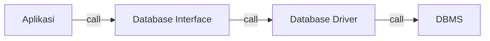

# Pengenalan Package Database

- Bahasa pemrograman Go secara default memiliki sebuah package bernama database
- Package database adalah package yang berisikan kumpulan standard interface yang menjadi standard untuk berkomunikasi ke database
- Hal ini menjadikan kode program yang kita buat untuk mengakses jenis database apapun bisa menggunakan kode yang sama
- Yang berbeda hanya kode SQL yang perlu kita gunakan sesuai dengan database yang kita gunakan

## Cara Kerja Package Database

