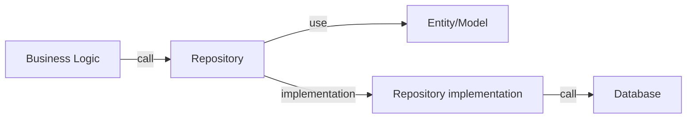

# Repository Pattern

- Dalam buku Domain-Driven Design, Eric Evans menjelaskan bahwa "repository is a mechanism for encapsulating storage, retrieval, and search behavior, which emulates a collection of objects"
- Pattern Repository ini biasanya digunakan sebagai jembatan antara business logic aplikasi kita dengan semua perintah SQL ke database
- Jadi semua perintah SQL akan ditulis di Repository, sedangkan busines logic kode program kita hanya cukup menggunakan Repository tersebut

## Diagram Repository Pattern

## Entity / Model

- Dalam pemrograman berorientasi object, biasanya sebuah tabel di database akan selalu dibuat representasinya sebagai class Entity atau Model, namun di Go, karena tidak mengenal Class jadi kita akan representasikan data dalam bentuk Struct
- Ini bisa mempermudah ketika membuat kode program
- Misal ketika kita query ke Repository, dibanding mengembalikan array, alangkah baiknya Repository melakukan konversi terlebih dahulu ke struct Entity/Model, sehingga kita tinggal menggunakan objectnya saja
